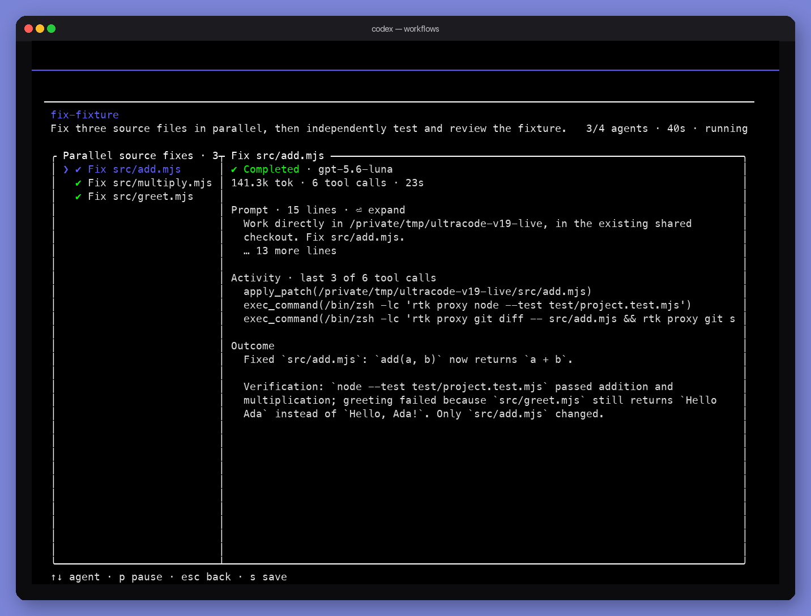

<p align="center"><strong>Codex Ultracode</strong> is a Codex CLI fork with a native workflow engine: two-pane phases and workers, <code>/workflows</code>, pause, resume, restart, and save.</p>
<p align="center">
  
</p>

This tree is based on Codex `0.153.4`. It is not official OpenAI Codex and is not kept on current `openai/codex` main. Use [GitHub Releases](https://github.com/Mako-L/codex-ultracode/releases) from this repo. Do not install `@openai/codex` or the ChatGPT installer if you want this fork.

## Install

Download a package from [Releases](https://github.com/Mako-L/codex-ultracode/releases):

- macOS Apple Silicon: `codex-package-aarch64-apple-darwin.tar.gz`
- Linux x86_64: `codex-package-x86_64-unknown-linux-gnu.tar.gz`
- Windows x64: `codex-package-x86_64-pc-windows-msvc.zip`

macOS / Linux:

```shell
gh release download --repo Mako-L/codex-ultracode --pattern 'codex-package-<target>.tar.gz'
mkdir -p "$HOME/.local/codex-ultracode"
tar -xzf codex-package-*.tar.gz -C "$HOME/.local/codex-ultracode"
printf '%s\n' '#!/bin/sh' 'exec "$HOME/.local/codex-ultracode/bin/codex" --native-workflow-host "$@"' > "$HOME/.local/bin/codex-ultracode"
chmod +x "$HOME/.local/bin/codex-ultracode"
```

Windows (PowerShell):

```powershell
gh release download --repo Mako-L/codex-ultracode --pattern 'codex-package-x86_64-pc-windows-msvc.zip'
Expand-Archive .\codex-package-x86_64-pc-windows-msvc.zip -DestinationPath "$env:LOCALAPPDATA\codex-ultracode" -Force
@'
@echo off
"%LOCALAPPDATA%\codex-ultracode\bin\codex.exe" --native-workflow-host %*
'@ | Set-Content -Path "$env:LOCALAPPDATA\Microsoft\WindowsApps\codex-ultracode.cmd"
```

## Run

```shell
codex-ultracode --native-workflow-host -m gpt-5.6-luna --effort low
```

Ask for a workflow, or type `/workflows`. From an empty composer, Down selects the workflow footer and Enter opens it. Resume with the same `codex-ultracode` launcher, not the official `codex` binary.

Sign in with ChatGPT or an API key the same way as upstream Codex.

## Build from source

```shell
git clone https://github.com/Mako-L/codex-ultracode.git
cd codex-ultracode
export CODEX_REPO_ROOT="$PWD"
/opt/homebrew/bin/python3 scripts/build_codex_package.py \
  --target aarch64-apple-darwin \
  --variant codex \
  --cargo-profile release \
  --node-bin /path/to/self-contained/node \
  --package-dir dist/codex-package \
  --archive-output dist/codex-package-aarch64-apple-darwin.tar.gz \
  --force
```

See [Installing & building](./docs/install.md) for the Rust toolchain.

## Docs

- [Codex Documentation](https://developers.openai.com/codex)
- [Installing & building](./docs/install.md)

This repository is licensed under the [Apache-2.0 License](LICENSE).
